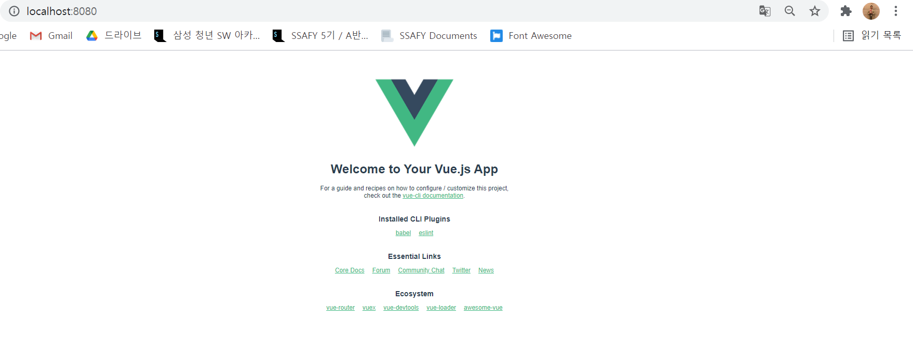

# 산출물
- Git hub Page & Action 

  - vue project 생성 
    - vue create project_name
    - Menually Select the features
    - 이후 아래 옵션들 선택합니다.
    - Check the features : Unit testing (필수)
    - Choose the version : 3.x
    - Pick a Linter  / Formatter config : ESLinter + Prettier
    - Pick a additional lint features :  Lint on save
    - Where do you  prefer placing config for Barbel, ESLint, etc
    - Save this as a preset for future project : N
  - yarn serve
  - 로컬 동작 확인

  

  - GitHub Pages로 배포하기 위한 라이브러리 추가

    - `yarn add gh-pages -D`

  - Package.json에 배포에 필요한 정보 추가

    - ` "homepage": "https://github.com/Gyujeong-Lee/Gyujeong-Lee.github.io.git",`

    - ```
        "scripts": {
          "serve": "vue-cli-service serve",
          "build": "vue-cli-service build",
          "predeploy": "vue-cli-service build",
          "deploy": "gh-pages -d dist",
          "clean": "gh-pages-clean",
          "test:unit": "vue-cli-service test:unit",
          "lint": "vue-cli-service lint",
        },
      ```

  - 배포용 Path 설정

    - <Username>.github.io인 경우 필요 x 

    - 그 외 다른 경로로 지정시 필요

    - vue.config.js 추가

      ```
      module.exports = {
        publicPath: "/vue-devops",
        outputDir: "dist"
      };
      ```

      